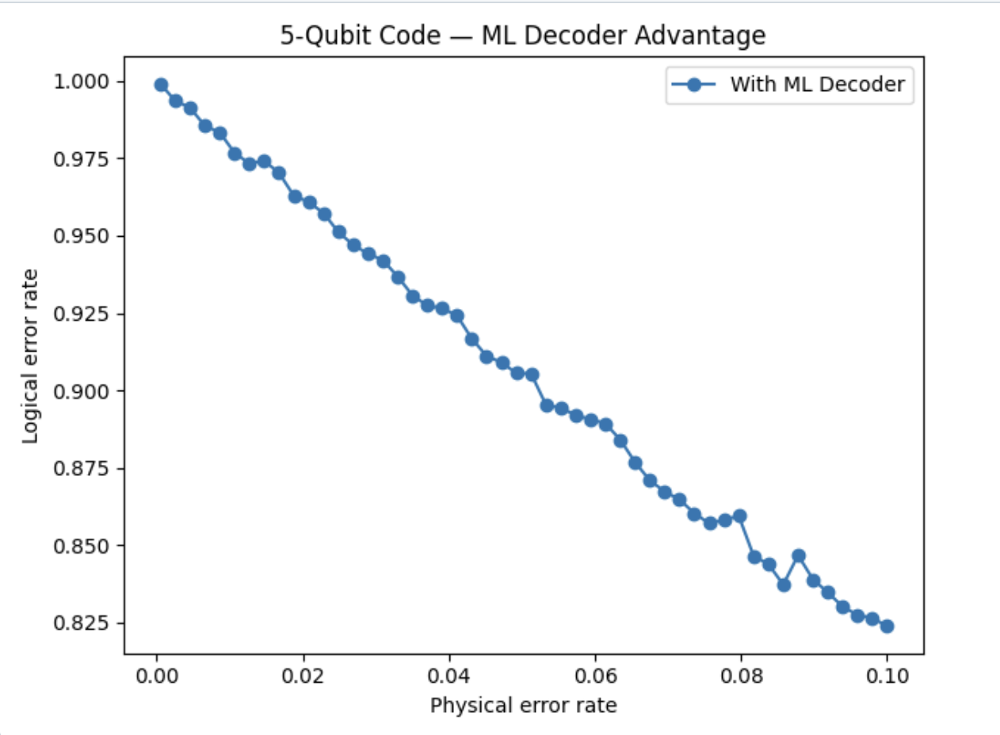
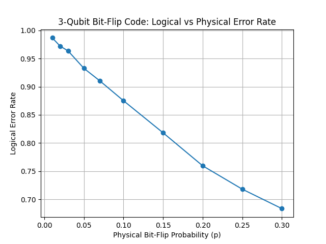
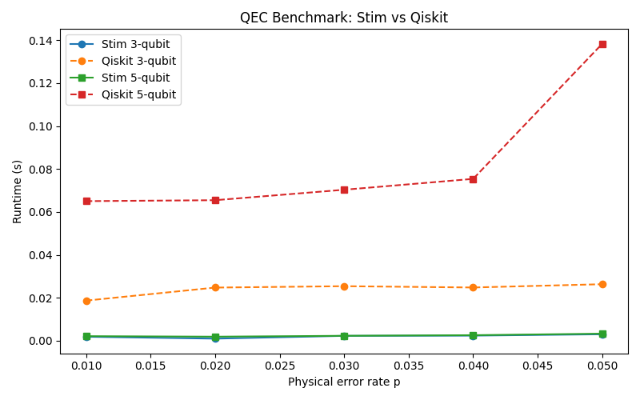

# QuantumErrorCorrectionSimulator

An error correction simulator for 3/5 Qubit repetition code circuits. 

Additionally a  comparative study of error correction performance between Stim and Qiskit frameworks, focusing on the 5-qubit code.

## Features

- **Dual Framework Support**: Implements the 5-qubit code in both Stim and Qiskit
- **MWPM Decoder**: Includes a Minimum-Weight Perfect Matching decoder for error correction
- **Performance Metrics**: Measures both logical error rates and runtime performance
- **Visualization**: Generates comparative plots of error correction performance

## Analysis

###        

  
  

### Time Performance

  

